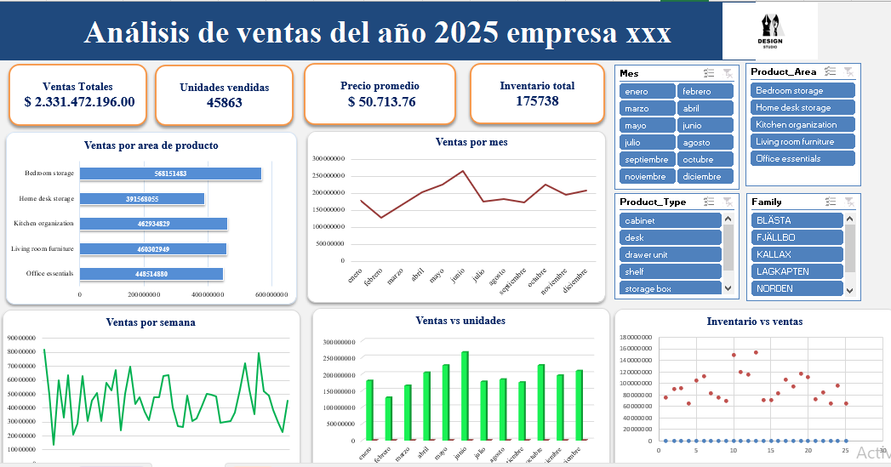

📊 Annual Sales Data Analysis

🎯 Contexto

Análisis de desempeño comercial de una empresa durante un año completo con el objetivo de identificar tendencias, estacionalidad y oportunidades de mejora en ventas.

🔎 Problema

La información estaba consolidada en una base de datos en Excel sin visualización estratégica para la toma de decisiones.

🛠 Proceso realizado

Limpieza y organización de datos.

Uso de fórmulas avanzadas (SUMIFS, VLOOKUP/XLOOKUP, cálculos de variación).

Creación de tablas dinámicas para segmentación por mes, categoría y producto.

Diseño de dashboard ejecutivo en Excel con KPIs comerciales.

📈 Resultados

Identificación de meses con mayor rentabilidad.

Detección de productos con bajo desempeño.

Visualización clara de variación mensual y tendencias.

🔧 Skills demostradas

Data Cleaning | Data Analysis | Pivot Tables | KPI Design | Dashboard Creation | Excel Avanzado
